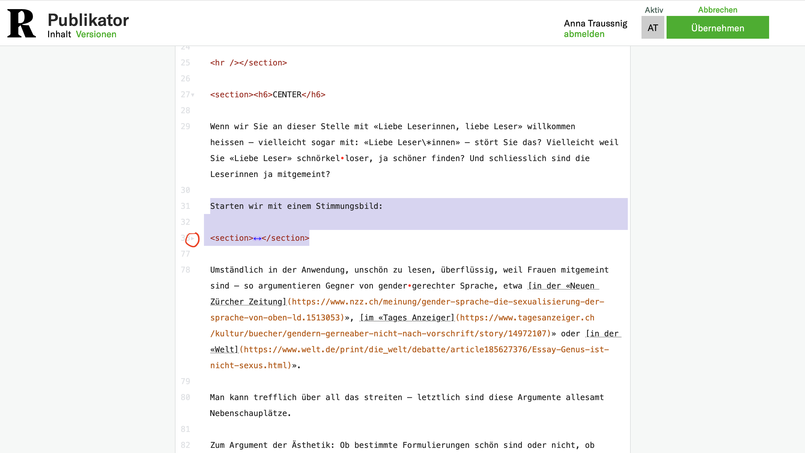

# Quellcode-Editor

Der Quellcode-Editor ist über einen Link im Sidebar des normalen Editors zugänglich: 
> 

Es gibt 2 wichtige Usecases dafür:

* [Templating](#Templating): bestehende Dokumente kopieren und als Muster für neue Dokumente verwenden
* [Copy-paste](#copy-paste): komplexe Elemente (z.B. Liste, Infoboxen) in einem Dokument verschieben

## Templating

Bestehende Dokumente kopieren und als Muster für neue Dokumente verwenden:

- Das Dokument, welches als Template verwendet werden soll öffnen und im Quellcode-Editor die Metadaten einblenden:
> 

- Den Editior öffnen (einfach drauf clicken), den ganzen Inhalt auswählen (ctrl-A/cmd-A funktioniert auch) und kopieren (ctrl-C/cmd-C):
> 

- Neues Dokument erstellen oder bestehendes Dokument öffnen, welches das Template verwenden soll.

- Quellcode-Editor öffnen und Metadaten einblenden auswählen.

- Bestehender Text selektieren und löschen.
> 

- Kopierter Inhalt reinpasten (ctrl-V/cmd-V).

- Änderungen übernehmen:
> 

- Et voila!

## Copy-paste

Komplexe Elemente im selben Dokument verschieben. Hier wollen wir z.B. eine Umfrage in die Mitte des Artikel verschieben:
> 
 
- Den Quellcode-Editor öffnen.

- Den relevanten Code finden (Im Beispiel das `<secion>` Element):
> 

- Den Code kopieren. Lange Code-Sections `<section>...</section>` können durch das `>` Zeichen auf der linken Seite des Editors kollabiert werden:
>  

- An der gewünschten Stelle pasten:
>  

- Änderungen übernehmen:
> 

- Et voila!
>  
