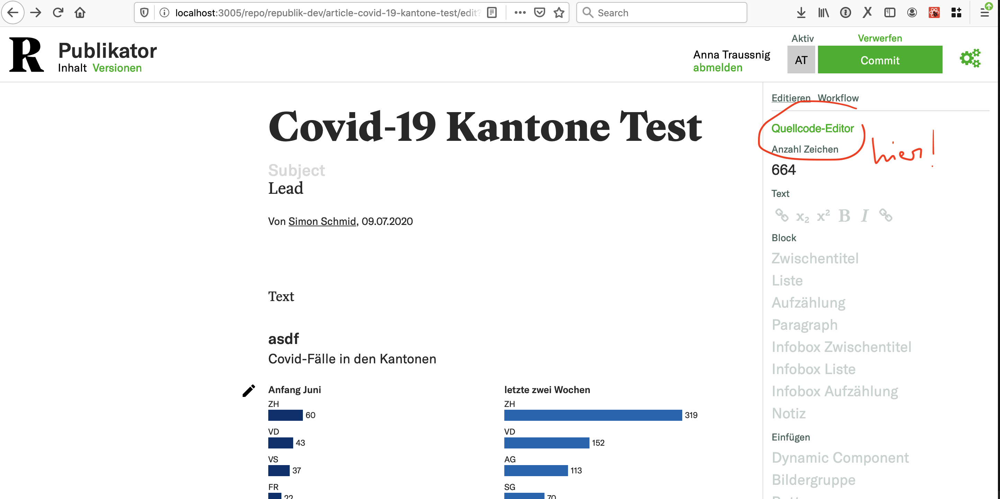
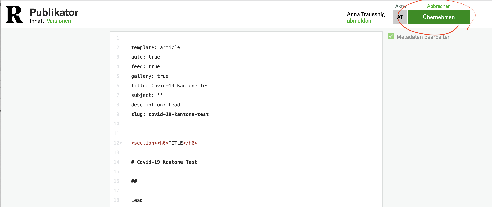

# Quellcode-Editor

Das Quellcode-Editor es durch einen Link in der Sidebar von normalen Editor zugänglich. 

Es gibt 2 wichtige Usecases dafür:

* [Templating](#Templating): bestehende Dokumente kopieren und als Muster für neue Dokumente verwenden
* [Copy-paste](#copy-paste): komplexe Elemente (z.B. Liste, Infoboxen) in einem Dokument verschieben

## Templating

Bestehende Dokumente kopieren und als Muster für neue Dokumente verwenden, how-to.

1. Im Dokument, was zu kopieren ist, rein, und im Quellcode-Editor.

2. Metadaten einblenden:

3. Im Editior rein (einfach drauf clicken), das ganze Inhalt selektieren (ctrl-A/cmd-A funktioniert auch) und kopieren:

4. Neues Dokument erstellen oder im Dokument rein, was die Template verwenden soll.

5. Quellcode-Editor aufmachen.

6. Metadaten einblenden.

7. Existierendes Text selektieren und löschen.

8. Inhalt von 3. reinpasten.

9. Änderungen übernehmen:

10. Et voila! 

Footnotes:

* Bilder funktionieren zurzeit nicht und sollen manuell im Dokument verlinkt werden

## Copy-paste

